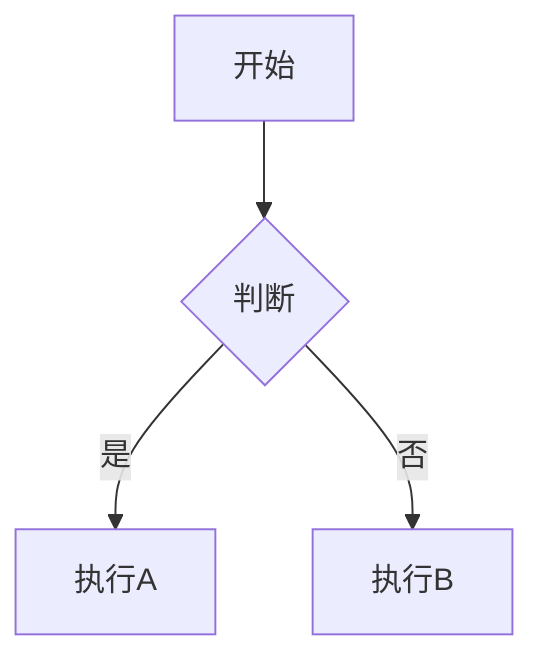

# Markdown 完整格式指南

## 一、标题

```markdown
# 一级标题
## 二级标题
### 三级标题
#### 四级标题
##### 五级标题
###### 六级标题（最小）
```

---

## 二、文字格式

| 格式 | 写法 | 效果 |
|------|------|------|
| 粗体 | `**粗体文字**` | **粗体文字** |
| 斜体 | `*斜体文字*` | *斜体文字* |
| 粗斜体 | `***粗斜体***` | ***粗斜体*** |
| 删除线 | `~~删除线~~` | ~~删除线~~ |
| 下划线 | `<u>下划线</u>` | 下划线 |
| 高亮 | `==高亮文字==` | 高亮文字 |
| 上标 | `X^2^` | X² |
| 下标 | `H~2~O` | H₂O |

---

## 三、列表

**无序列表：**

```markdown
- 项目一
- 项目二
  - 子项目 A（前面加两个空格）
  - 子项目 B
- 项目三
```

**有序列表：**

```markdown
1. 第一步
2. 第二步
3. 第三步
```

**任务列表（勾选框）：**

```markdown
- [x] 已完成任务
- [ ] 待办任务
- [ ] 另一项待办
```

---

## 四、链接与图片

**链接：**

```markdown
[显示文字](https://www.example.com)

[带提示的链接](https://www.example.com "鼠标悬停显示的文字")

[引用式链接][id]

[id]: https://www.example.com
```

**图片：**

```markdown


<!-- 点击图片跳转链接 -->
[](跳转链接)
```

---

## 五、引用

```markdown
> 这是一段引用
> 可以多行
>
> > 嵌套引用（前面加两个 >）
```

---

## 六、代码

**行内代码：**

```markdown
使用 `print("hello")` 函数
```

**代码块（带语法高亮）：**

````markdown
```javascript
function hello() {
    console.log("Hello World!");
}
```

```python
def hello():
    print("Hello World!")
```

```bash
npm install hexo-admin
```
````

---

## 七、表格

```markdown
| 左对齐 | 居中对齐 | 右对齐 |
|:-------|:--------:|-------:|
| 内容   | 内容     | 内容   |
| 数据   | 数据     | 数据   |
```

---

## 八、分隔线

```markdown
---

***

___
```

三种写法效果一样，都是一条横线。

---

## 九、脚注

```markdown
这是一段带脚注的文字[^1]。

[^1]: 这是脚注的内容。
```

---

## 十、转义字符

如果文字本身就是 `*` 或 `#` 等特殊字符，在前面加 `\` 即可：

```markdown
\* 这不是斜体 \*
\# 这不是标题
\> 这不是引用
```

---

## 十一、HTML 标签

Markdown 支持直接嵌入 HTML：

```markdown
<center>居中文字</center>

<font color="red">红色文字</font>

<br>  <!-- 强制换行 -->

<details>
<summary>点击展开</summary>
隐藏的内容在这里
</details>
```

---

## 十二、常用模板

**插入视频：**

```markdown
<iframe src="视频地址" width="100%" height="500"></iframe>
```

**温馨提示框：**

```markdown
> **提示：** 这是一条重要提示信息。
```

**带图标的内容：**

```markdown
- ✅ 已完成
- ⚠️ 注意
- ❌ 错误
- 💡 提示
- 📌 重点
```

---

## 十三、Emoji 表情

```markdown
:smile: :heart: :thumbsup: :fire: :star:
```

---

## 十四、目录

在文章任意位置插入，自动生成目录：

```markdown
[TOC]
```

---

## 十五、流程图（Mermaid）

````markdown

````