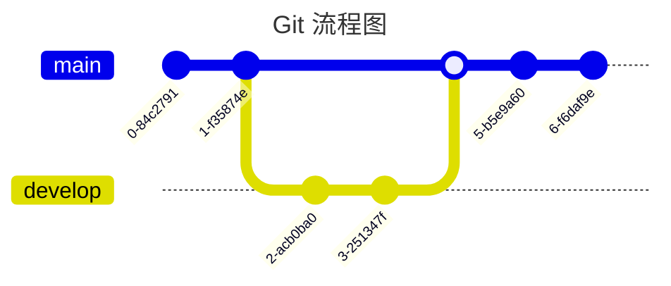

## 一、基础文字格式

### 1.1 标题

使用 `#` 号定义标题，支持 1-6 级：

```markdown
# 一级标题
## 二级标题
### 三级标题
#### 四级标题
##### 五级标题
###### 六级标题
```

### 1.2 加粗

```markdown
**加粗文字**
```

### 1.3 斜体

```markdown
_斜体文字_
```

### 1.4 删除线

```markdown
~~删除线文字~~
```

### 1.5 下划线

```markdown
<u>下划线文字</u>
```

### 1.6 上标与下标

```markdown
I have a dream that one day this nation will rise up.^[1]^

I have a dream that one day this nation will rise up.~[2]~
```

### 1.7 行内代码与块级代码

行内代码使用单反引号：

```markdown
`md-editor-v3`
```

块级代码使用三个反引号，支持语法高亮：

````markdown
```tsx
import { useState } from "react";

export function EditorDemo() {
  const [text, setText] = useState("Hello Editor!");
  return <pre>{text}</pre>;
}
```
````


### 1.8 超链接

```markdown
[安知鱼博客](https://blog.anheyu.com)
```

### 1.9 引用

```markdown
> 引用内容
```

### 1.10 列表

**有序列表：**

```markdown
1. 第一项
2. 第二项
3. 第三项
```

**无序列表：**

```markdown
- 项目一
- 项目二
- 项目三
```

**任务列表：**

```markdown
- [ ] 待办事项
- [x] 已完成事项
```

### 1.11 表格

```markdown
| 表头 1 |  表头 2  | 表头 3 | 表头 4 |
| :----- | :------: | -----: | ------ |
| 左对齐 | 中间对齐 | 右对齐 | 默认   |
```

> 表格会自动添加容器包装，支持横向滚动，在移动端也能良好展示。

### 1.12 分隔线

```markdown
---

***

___
```

---

## 二、图片增强

### 2.1 基础用法

```markdown

```

### 2.2 图片标题（鼠标悬停提示）

第三个参数为 `title`，鼠标悬停时显示：

```markdown

```

### 2.3 图片描述（Caption）

使用 `{caption="描述文字"}` 添加底部描述：

```markdown
{caption="这是图片描述"}
```

渲染为 `<figcaption>` 标签。

### 2.4 图片尺寸

```markdown
{width=800 height=600}
```

### 2.5 图片对齐方式

支持 `left`、`center`、`right`，默认为 `center`：

```markdown
{align=left}
{align=center}
{align=right}
```

### 2.6 组合使用

```markdown
{caption="底部描述" width=800 align=center}
```

**增强属性：** `caption`（底部描述）、`width`/`height`（尺寸）、`align`（对齐：left/center/right）

---

## 三、行内样式

安知鱼主题提供丰富的行内样式标签。

### 3.1 下划线

```markdown
{u}这是下划线文字{/u}

{u color=#FF6B9D}这是彩色下划线{/u}
```

### 3.2 着重号

```markdown
{emp}这是着重号文字{/emp}

{emp color=#42b983}这是彩色着重号{/emp}
```

### 3.3 波浪线

```markdown
{wavy}这是波浪线文字{/wavy}

{wavy color=#FF6B9D}这是彩色波浪线{/wavy}
```

### 3.4 删除线（自定义样式）

```markdown
{del}这是删除线文字{/del}

{del color=#999}这是灰色删除线{/del}
```

### 3.5 键盘样式

```markdown
按 {kbd}Ctrl{/kbd} + {kbd}S{/kbd} 保存文件

{kbd color=#42b983}Enter{/kbd}
```

### 3.6 密码样式

```markdown
密码是：{psw}password123{/psw}

{psw color=#000}hidden-text{/psw}
```

---

## 四、标签页（Tabs）

标签页可以切换显示不同内容块。

### 4.1 基础用法

```markdown
:::tabs

== tab JavaScript
```js
const hello = "Hello World";
console.log(hello);
```

== tab TypeScript
```ts
const hello: string = "Hello World";
console.log(hello);
```

== tab React
```tsx
export function Hello() {
  const hello = "Hello World";
  return <div>{hello}</div>;
}
```

:::
```

### 4.2 指定默认激活的标签

```markdown
:::tabs active=2

== tab 第一个标签
内容 1

== tab 第二个标签
内容 2（默认激活）

== tab 第三个标签
内容 3

:::
```

---

## 五、折叠框（Folding）

折叠框可以隐藏长内容，用户点击标题即可展开查看。

### 5.1 基础用法

```markdown
:::folding
折叠框标题
这是折叠框的内容，默认是收起状态。
支持 **Markdown** 语法。
:::
```

### 5.2 默认展开

```markdown
:::folding open
默认展开的折叠框
这个折叠框默认是展开状态。
:::
```

### 5.3 自定义颜色

```markdown
:::folding #FF6B9D
粉色折叠框
使用十六进制颜色值自定义边框和标题背景色。
:::

:::folding open #42b983
绿色折叠框（默认展开）
同时设置展开状态和自定义颜色。
:::
```

---

## 六、隐藏内容（Hidden）

### 6.1 块级隐藏内容

```markdown
:::hidden
这是默认的隐藏内容，点击"查看隐藏内容"按钮后显示。
支持 **Markdown** 语法。
:::
```

### 6.2 自定义按钮文字

```markdown
:::hidden display=点击查看答案
这是一道题目的答案。
:::
```

### 6.3 自定义按钮颜色

```markdown
:::hidden display=查看彩蛋 bg=#FF6B9D color=#fff
这是一个彩蛋内容！
:::
```

### 6.4 行内隐藏内容

```markdown
这是一段文字，{hide display=查看}这部分内容被隐藏了{/hide}，点击按钮查看。

自定义颜色：{hide display=答案 bg=#42b983 color=#fff}正确答案是 42{/hide}
```

---

## 七、按钮（Button）

### 7.1 基础按钮

```markdown
{btn url=https://blog.anheyu.com text=访问博客}{/btn}
```

### 7.2 自定义图标

```markdown
{btn url=https://github.com text=GitHub icon=anzhiyu-icon-github-line}{/btn}
```

### 7.3 按钮颜色

支持的颜色：`blue`、`pink`、`red`、`purple`、`orange`、`green`

```markdown
{btn url=# text=蓝色按钮 color=blue}{/btn}
{btn url=# text=粉色按钮 color=pink}{/btn}
{btn url=# text=红色按钮 color=red}{/btn}
```

### 7.4 描边样式

```markdown
{btn url=# text=描边按钮 style=outline color=blue}{/btn}
```

### 7.5 更大尺寸

```markdown
{btn url=# text=大按钮 size=larger color=blue}{/btn}
```

### 7.6 块级布局

```markdown
{btn url=# text=块级按钮 layout=block}{/btn}
{btn url=# text=居中按钮 layout=block position=center}{/btn}
{btn url=# text=右对齐按钮 layout=block position=right}{/btn}
```

### 7.7 组合示例

```markdown
{btn url=https://blog.anheyu.com text=访问博客 icon=anzhiyu-icon-link color=blue size=larger layout=block position=center}{/btn}
```

---

## 八、按钮组（Btns）

按钮组用于展示多个带有图标和描述的大型按钮，特别适合展示团队成员、合作伙伴、友情链接等场景。

### 8.1 基础用法

```markdown
:::btns

icon=anzhiyu-icon-shapes title=张三 url=https://example.com desc=前端工程师
icon=anzhiyu-icon-shapes title=李四 url=https://example.com desc=后端工程师
icon=anzhiyu-icon-shapes title=王五 url=https://example.com desc=UI 设计师

:::
```

### 8.2 使用列表格式

```markdown
:::btns

- icon=anzhiyu-icon-shapes title=张三 url=https://example.com desc=前端工程师
- icon=anzhiyu-icon-shapes title=李四 url=https://example.com desc=后端工程师
- icon=anzhiyu-icon-shapes title=王五 url=https://example.com desc=UI 设计师

:::
```

### 8.3 自定义列数

默认为 3 列，可以设置 1-6 列：

```markdown
:::btns cols=4

- icon=anzhiyu-icon-github-fill title=GitHub url=https://github.com desc=代码托管平台
- icon=anzhiyu-icon-twitter-fill title=Twitter url=https://twitter.com desc=社交媒体平台
- icon=anzhiyu-icon-bilibili-fill title=Bilibili url=https://bilibili.com desc=视频分享网站
- icon=anzhiyu-icon-wechat-fill title=微信 url=# desc=即时通讯工具

:::
```

### 8.4 按钮颜色

```markdown
:::btns cols=3

- icon=anzhiyu-icon-shapes title=蓝色成员 url=# desc=前端开发 color=blue
- icon=anzhiyu-icon-shapes title=粉色成员 url=# desc=设计师 color=pink
- icon=anzhiyu-icon-shapes title=绿色成员 url=# desc=后端开发 color=green

:::
```

### 8.5 样式风格

支持的样式：`default`、`card`、`simple`

```markdown
:::btns style=card

- icon=anzhiyu-icon-shapes title=卡片样式 url=# desc=使用卡片风格展示
- icon=anzhiyu-icon-shapes title=卡片样式 url=# desc=使用卡片风格展示

:::
```

### 8.6 参数说明

**容器参数：** `cols`（列数 1-6，默认 3）、`style`（`default`/`card`/`simple`）

**按钮参数：**

| 参数 | 说明 | 可选值 |
|------|------|--------|
| `icon` | 图标（必需） | AnZhiYu 图标、Iconify 图标、图片 URL |
| `title` | 标题（必需） | 自定义文字 |
| `url` | 链接地址 | 任意 URL |
| `desc` | 描述文字 | 自定义文字 |
| `color` | 颜色 | `blue`/`pink`/`red`/`purple`/`orange`/`green` |

---

## 九、图片组（Gallery）

图片组可以创建美观的网格布局图片展示，支持自定义列数、间距和图片宽高比等参数。

### 9.1 基础用法

```markdown
:::gallery


:::
```

### 9.2 自定义列数

默认为 3 列，可以设置 1-6 列：

```markdown
:::gallery cols=4


:::
```

### 9.3 设置图片间距

```markdown
:::gallery gap=20px


:::
```

### 9.4 固定宽高比

让所有图片保持统一的宽高比：

```markdown
:::gallery ratio=16:9


:::
```

**常用宽高比：**

| 比例 | 说明 |
|:-----|:-----|
| 1:1 | 正方形 |
| 16:9 | 宽屏 |
| 4:3 | 传统屏幕 |
| 3:2 | 照片常用比例 |

### 9.5 组合参数

```markdown
:::gallery cols=3 gap=15px ratio=1:1


:::
```

### 9.6 参数说明

| 参数 | 说明 | 默认值 |
|------|------|--------|
| `cols` | 列数 1-6 | 3 |
| `gap` | 间距 | 10px |
| `ratio` | 宽高比 | 无 |

> 图片格式使用标准 Markdown 语法：``

---

## 十、视频画廊（Video Gallery）

视频画廊可以创建美观的网格布局视频展示，支持自定义列数、间距和视频宽高比，悬停时显示播放图标。

### 10.1 基础用法

```markdown
:::video-gallery
url=视频地址1 title=视频标题1
url=视频地址2 title=视频标题2
:::
```

### 10.2 自定义列数

默认为 2 列，可以设置 1-4 列：

```markdown
:::video-gallery cols=3
url=视频地址1 title=视频标题1
url=视频地址2 title=视频标题2
url=视频地址3 title=视频标题3
:::
```

### 10.3 设置视频间距

```markdown
:::video-gallery gap=20px
url=视频地址1 title=视频1
url=视频地址2 title=视频2
:::
```

### 10.4 固定宽高比

**常用宽高比：**

| 比例 | 说明 |
|:-----|:-----|
| 16:9 | 宽屏（默认） |
| 4:3 | 传统屏幕 |
| 1:1 | 正方形 |

```markdown
:::video-gallery ratio=16:9
url=视频地址1 title=宽屏视频1
url=视频地址2 title=宽屏视频2
:::
```

### 10.5 添加封面图和描述

```markdown
:::video-gallery
url=视频地址1 title=教程视频 poster=封面图地址 desc=详细的教程说明
url=视频地址2 title=演示视频 poster=封面图地址 desc=功能演示
:::
```

### 10.6 参数说明

**容器参数：** `cols`（列数 1-4，默认 2）、`gap`（间距，默认 16px）、`ratio`（宽高比，默认 16:9）

**视频参数：** `url`（必填）、`title`、`poster`（封面图）、`desc`

---

## 十一、音乐播放器（Music Player）

音乐播放器可以在文章中嵌入美观的网易云音乐播放器，进度条颜色会自动匹配封面主色。

### 11.1 基础用法

```markdown
{music id=554241732}{/music}
```

只需提供网易云音乐的歌曲 ID，系统会自动获取歌曲信息、封面和音频 URL。

### 11.2 获取歌曲 ID

1. 打开网易云音乐网页版或客户端
2. 找到你喜欢的歌曲
3. 复制歌曲链接，ID 就是链接中的数字

例如：`https://music.163.com/#/song?id=554241732`，ID 就是 `554241732`

### 11.3 多首歌曲列表

```markdown
{music id=554241732}{/music}

{music id=1974443814}{/music}

{music id=1868553}{/music}
```

---

## 十二、链接卡片（LinkCard）

链接卡片可以创建美观的链接展示，支持自定义图标、标题和描述信息。

### 12.1 基础用法

```markdown
{linkcard url=https://blog.anheyu.com title=安知鱼 sitename=AnZhiYu}{/linkcard}
```

### 12.2 自定义图标

**字体图标：**

```markdown
{linkcard url=https://github.com title=GitHub sitename=代码托管平台 icon=anzhiyu-icon-github}{/linkcard}
```

**HTTP 图标链接：**

```markdown
{linkcard url=https://www.google.com title=Google sitename=搜索引擎 icon=https://www.google.com/favicon.ico}{/linkcard}
```

### 12.3 自定义提示文本

```markdown
{linkcard url=https://www.google.com title=Google sitename=搜索引擎 tips=访问搜索引擎}{/linkcard}
```

### 12.4 参数说明

| 参数 | 说明 | 默认值 |
|------|------|--------|
| `url` | 链接地址 | `#` |
| `title` | 链接标题 | 链接标题 |
| `sitename` | 网站名称 | 网站名称 |
| `icon` | 图标 | `anzhiyu-icon-link` |
| `tips` | 提示文本 | 引用站外地址 |

---

## 十三、提示块（Note / Tip / Warning / Danger）

块级提示框以 `!!!` 开头并紧跟类型名，以单独一行的 `!!!` 结束。

> **注意：** 旧版 `:::type ... :::` 仍可渲染，但新建内容请使用 `!!!` 语法。

```markdown
!!! note 注意

这是「注意」样式，用于一般说明。

!!!

!!! tip 提示

这是「提示」样式。

!!!

!!! warning 警告

这是「警告」样式。

!!!

!!! danger 危险

这是「危险」样式。

!!!
```

---

## 十四、数学公式

### 14.1 行内公式

```markdown
$x+y^{2x}$
```

### 14.2 块级公式

```markdown
$$
\sqrt[3]{x}
$$
```

---

## 十五、图表（Mermaid）

```markdown

```

---

## 十六、自定义 HTML 样式

### 16.1 彩色文字

```markdown
<font color="#00ffff" size="7">青色大字体</font>
```

### 16.2 文本对齐

```markdown
<p style="text-align:center">居中文字</p>
<p style="text-align:right">右对齐文字</p>
```

---

## 十七、PRO 版本专享功能

以下功能需要 PRO 版本支持。

### 17.1 付费内容（Paid Content）

#### 基础用法

```markdown
:::paid-content
这是一段付费内容，只有购买后才能查看完整内容。

付费内容可以包含：
- 文字内容
- **格式化文本**
- `代码片段`
- > 引用内容
:::
```

#### 自定义标题和价格

```markdown
:::paid-content title="高级教程" price="9.9" original-price="19.9" currency="¥"
这是一个自定义标题和价格的付费内容示例。

当原价大于当前价格时，会显示限时特惠标识。
:::
```

#### 参数说明

| 参数 | 说明 | 默认值 |
|------|------|--------|
| `title` / `paid-title` | 付费内容标题 | "付费内容" |
| `price` | 当前价格 | 1.0 |
| `original-price` | 原价（用于显示优惠） | 0.0 |
| `currency` | 货币单位 | "¥" |

### 17.2 提示框（Tip）

#### 基础用法

```markdown
{tip text=鼠标悬停提示 content=这是一个基础的悬停提示}{/tip}
```

#### 点击触发

```markdown
{tip text=点击我查看提示 content=这是一个点击触发的提示 trigger=click}{/tip}
```

#### 不同主题

```markdown
{tip text=成功提示 content=操作成功完成！ theme=success}{/tip}
{tip text=信息提示 content=这是一条信息提示 theme=info}{/tip}
{tip text=警告提示 content=请注意这个警告 theme=warning}{/tip}
{tip text=错误提示 content=发生了一个错误 theme=error}{/tip}
{tip text=浅色主题 content=这是浅色主题的提示 theme=light}{/tip}
```

#### 不同位置

```markdown
{tip text=顶部显示 content=提示显示在顶部 position=top}{/tip}
{tip text=底部显示 content=提示显示在底部 position=bottom}{/tip}
{tip text=左侧显示 content=提示显示在左侧 position=left}{/tip}
{tip text=右侧显示 content=提示显示在右侧 position=right}{/tip}
```

#### 自定义延迟

```markdown
{tip text=快速显示 content=立即显示的提示 delay=0}{/tip}
{tip text=延迟显示 content=延迟 500ms 显示的提示 delay=500}{/tip}
```

#### 参数说明

| 参数 | 说明 | 可选值 | 默认值 |
|------|------|--------|--------|
| `text` | 显示文本 | — | — |
| `content` | 提示内容 | — | — |
| `theme` | 主题样式 | `dark`/`light`/`info`/`warning`/`error`/`success` | `dark` |
| `position` | 显示位置 | `top`/`bottom`/`left`/`right` | `top` |
| `trigger` | 触发方式 | `hover`/`click` | `hover` |
| `delay` | 延迟时间 ms | — | 300 |

---

## 十八、编辑器特色功能

| 功能 | 说明 |
|------|------|
| 🔄 代码折叠 | 自动折叠超过指定行数的代码块，默认超过 10 行自动折叠 |
| 📋 一键复制 | 每个代码块都有复制按钮 |
| 🌙 主题切换 | 自动根据网站主题切换明暗模式 |
| 💾 自动保存 | 支持 `Ctrl+S` 快捷键保存内容 |
| 🎯 智能表格 | 表格自动添加容器包装，支持横向滚动，移动端也能良好展示 |