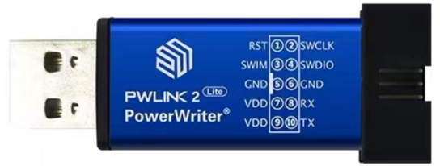
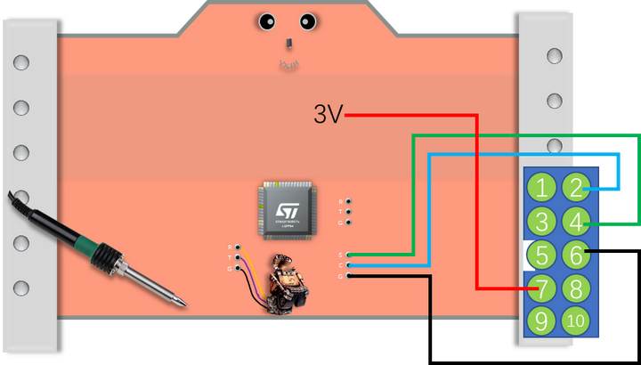
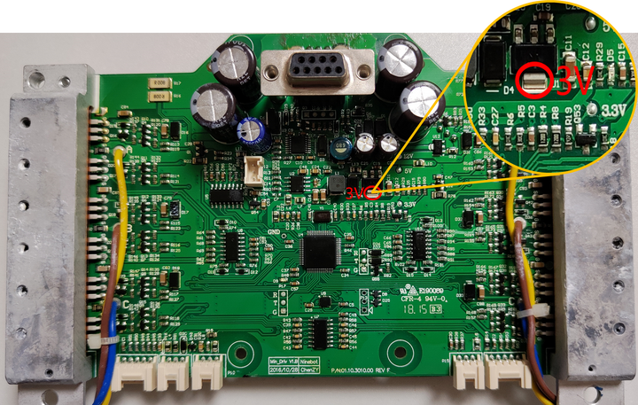
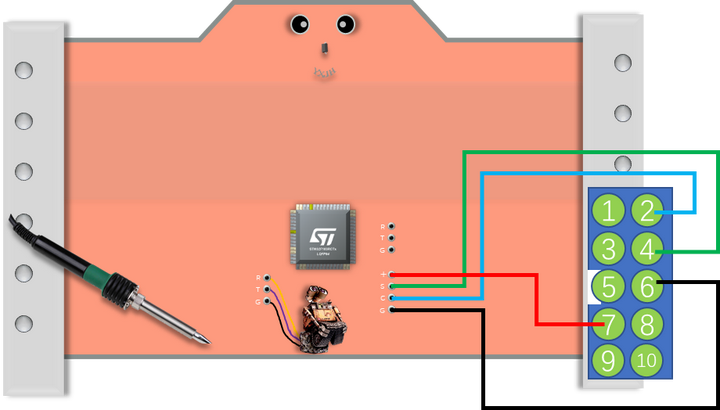
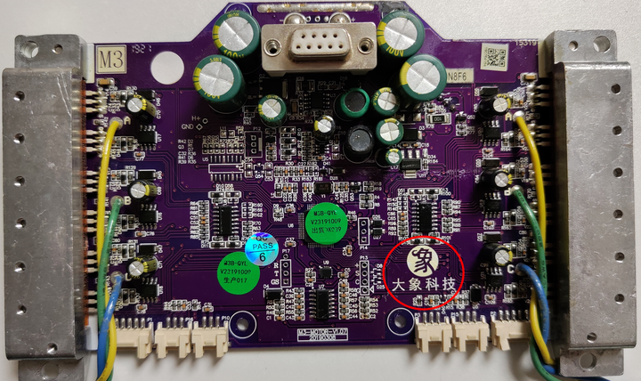
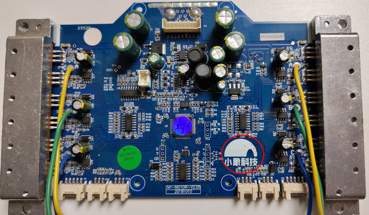
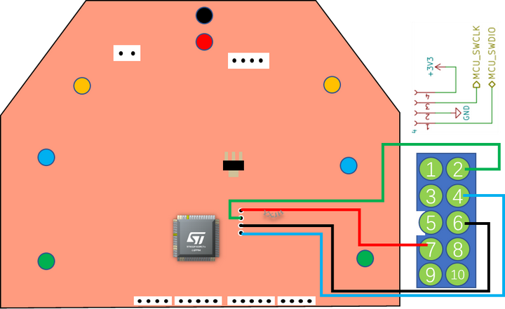
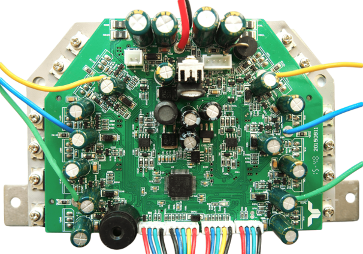

**卡丁车主板刷机接线图（平衡车主板刷卡丁车）**

**一、PWlink2（Lite）烧录器**

{width="5.708661417322834in" height="2.15621719160105in"}

PWlink2（Lite）烧录器

这款烧录器是"创芯工坊"研发生产，软件界面全中文，支持在线一键烧录。

注意：烧录器豁口处对应序号①③⑤⑦⑨

**二、小米mini平衡车主板刷机接线图**

{width="5.708661417322834in" height="3.247674978127734in"}

小米mini平衡车主板与PWlink2烧录器的接线顺序

{width="5.708661417322834in" height="3.622140201224847in"}

小米mini平衡车主板3V位置

**三、大象科技、小象科技平衡车主板刷机接线图**

{width="5.708661417322834in" height="3.247674978127734in"}

大象科技、小象科技平衡车主板与PWlink2烧录器的接线顺序

{width="5.708661417322834in" height="3.3959733158355205in"}

大象科技平衡车主板实物图

{width="18.04722222222222in" height="10.5375in"}

小象科技平衡车主板实物图

**四、梯形板刷机接线图**

{width="9.556944444444444in" height="5.8493055555555555in"}

添加图片注释，不超过 140 字（可选）

{width="6.311111111111111in" height="4.415277777777778in"}

梯形板实物图
